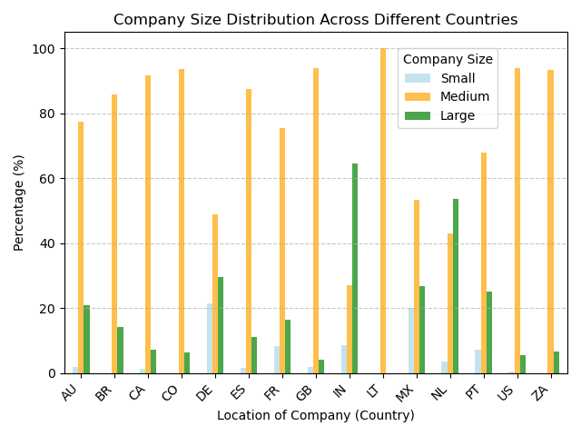
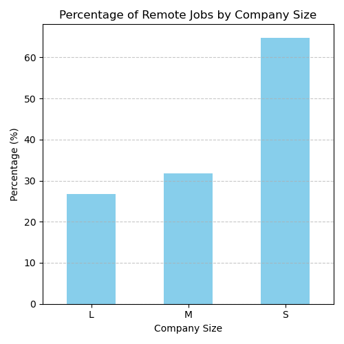
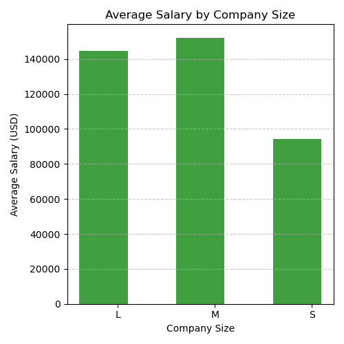
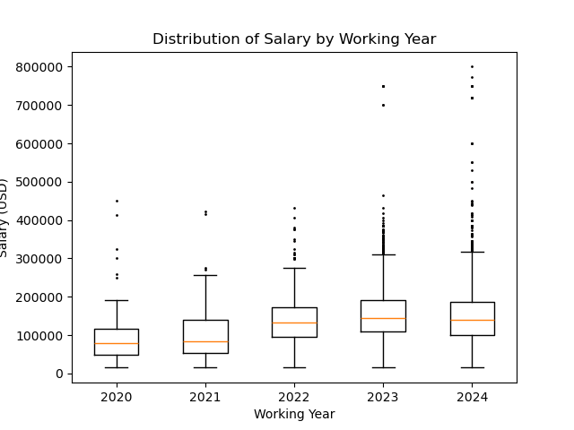
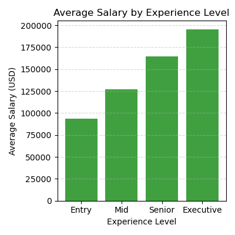
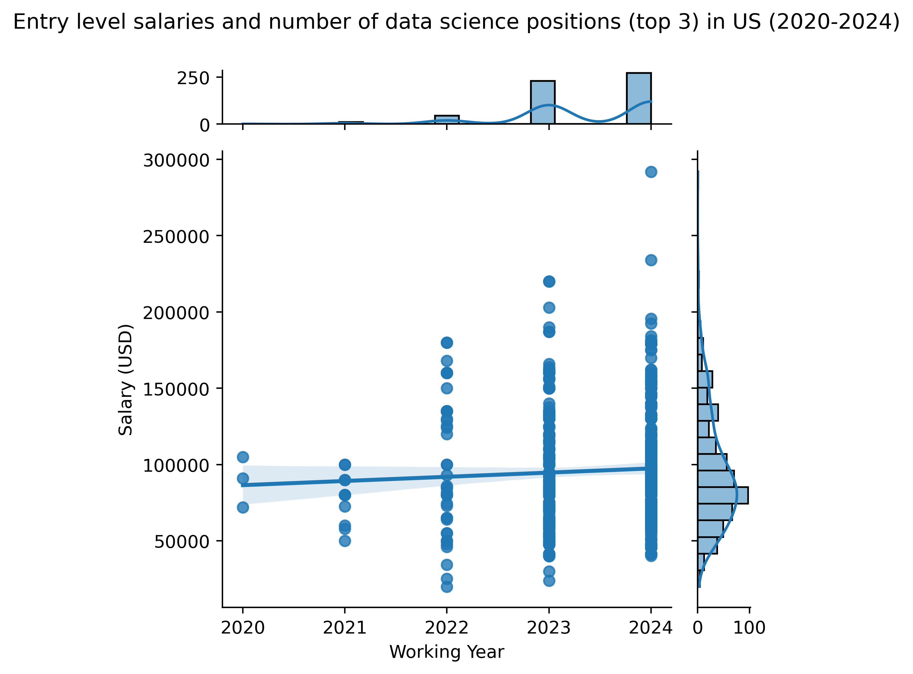
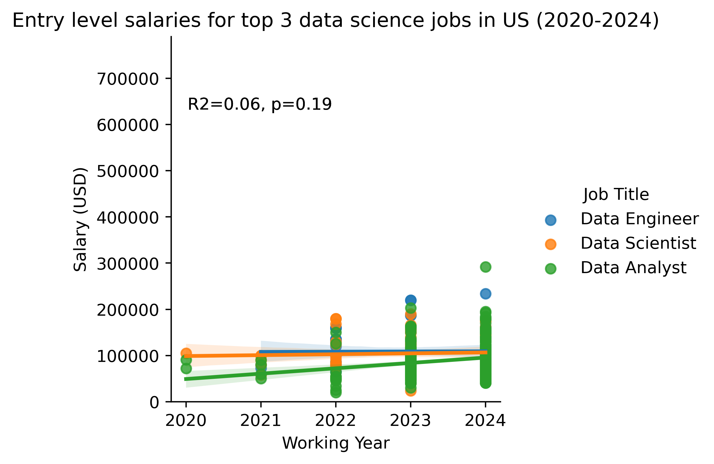

# Trends in Data Science Jobs from 2020 to 2024 (project-one group-5) 
## The following research questions were addressed using the data set found in https://www.kaggle.com/datasets/saurabhbadole/latest-data-science-job-salaries-2024

## Is There a Relationship Between a Country’s Average Salary and its Percentage of Company Size?

Results from this analysis suggest no relationship between average salary and country, and looking at specific countries such as the US and IN would be misleading and may not be used to generalized relationships between average salary and country. Countries such as AU and LT make the lack of relation apparent. It is possible that additional variables not reported in the dataset may be influencing a country's average salary (e.g., country’s level of development and cost of living).

## Who Offers More Remote Work Options? Large or Small Companies?
 

The dataset suggests that smaller companies are offering the most remote however, they don’t pay nearly as much on average as large and medium sized companies

The difference in pay between medium and larger companies is very small, however, medium companies do have a slight edge in both pay and remote opportunities

## What is the Distribution of Salary by Year?

A results summary showed that the IQR for the data set was $87,000, and the first, second and third quartiles were $100,000, $140,000 and $187,000, respectively. The box plot shows an increase in salary on a yearly basis, with the exception of 2023 to 2024. Data also suggests that the salaries for new entrants (entry level) in the data scientist field are increasing. It is important to note that 2024 has several outliers. In addition, unlike years 2020 through 2023, we need to acknowledge that 2024 only contains data reported up to March. Notably, the outliers observed in 2024 will no longer be outliers if this trend persists in the future. Otherwise, we note that the dataset does not have any extreme variances.

## What is the Trend in Average Salary by Experience Level?
 

The data table summarizes the average salaries by work experience from 2020-2024. Results showed an overall increase in average salary. Numbers for year 2021 may be skewed due to COVID pandemic affecting data science jobs. The bar graph showcases the combined average salaries by work experience from 2020 through 2024. In addition, results suggest that the more experience obtained in Data Science professions, the higher the salary

## What is in the Future for Data Science Jobs in the US?
 

Linear regression analysis was used to determine salary patterns (2020-2024) for top 3 data science jobs (most counts) in US (only entry level results are shown). Middle, senior and executive level results are available in the repository. There was no association between year and salary per year (USD) from 2020-2024 for top 3 data science jobs in US at the entry level (R2 = 0.06). While a similar pattern was noted regardless of job title, more positions became available in 2023 and 2024 (top histogram) for entry level positions, with similar salaries per year (USD) (right histogram). Future analysis may include additional data science positions.

## Assumptions and Limitations

-Our data is on a yearly basis, except for 2024, which only includes data  through March 2024.

-While nearly 15,000 records long, our dataset only contains 4 full years of data.

-The data was collected through surveys, job postings, and public disclosures from various sources throughout the industry. This could exclude certain postings, websites, or other job resources. 

-In addition, some of the metadata may be needing curation for consistency.

-This data does not contain an equal amount of samples from every country (majority located in the US), causing the overall results to be skewed. 

## The repo contains .ipynb code to run separate analyses to answer the questions described above. The repo also contains an 'image' folder with the plots generated by each code. While only relevant results were showcased in the presentation, supplementary plots can be found within the jupyter notebooks.

